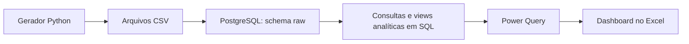
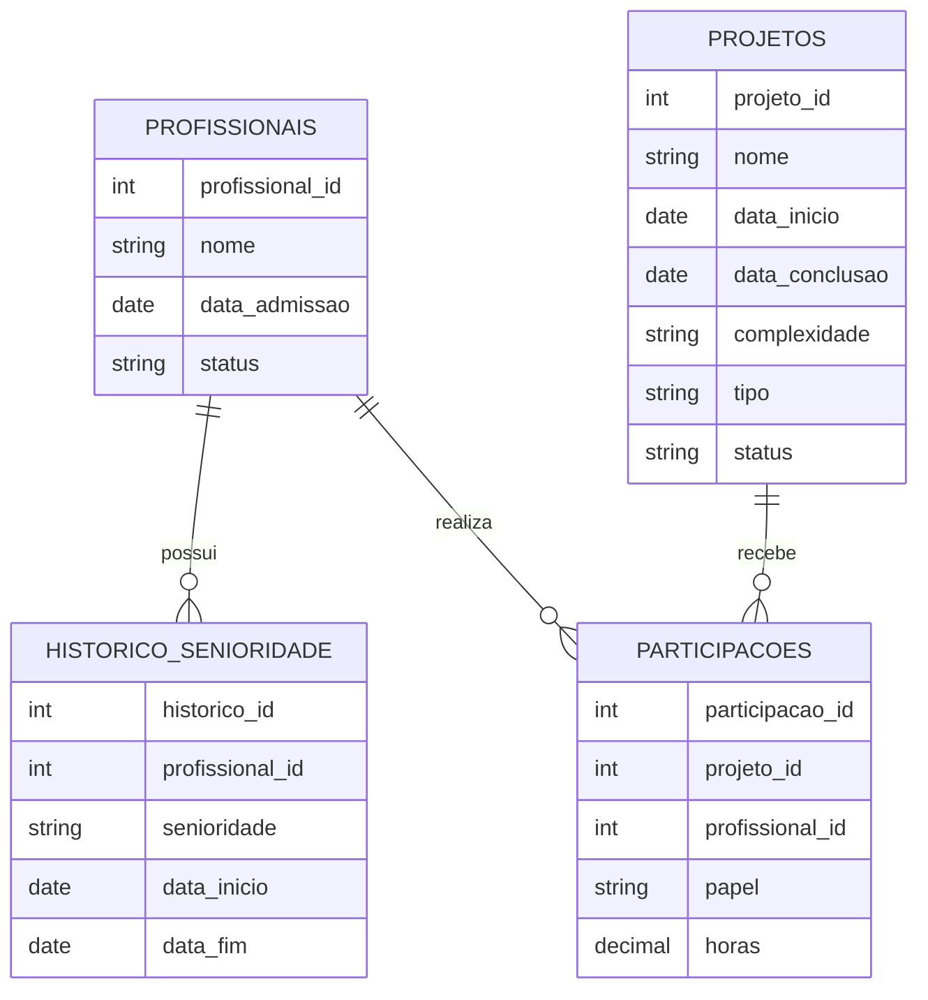

# Análise de Projetos por Senioridade

Projeto de portfólio para analisar a distribuição temporal de projetos e participações entre profissionais júnior, pleno e sênior, usando PostgreSQL, SQL e Excel.

O projeto utiliza **dados fictícios** e demonstra um fluxo de análise que parte de arquivos CSV, passa pela carga e validação no PostgreSQL e, ao final, alimenta consultas analíticas e um dashboard em Excel.

> **Status:** os dados fictícios já foram carregados e auditados no PostgreSQL. As análises e as duas views de senioridade estão criadas. Scripts aditivos para preparar e validar a camada staging estão em sql/09 a sql/13; confira a seção abaixo antes de executá-los no banco local.

## Objetivo

Investigar como o volume de projetos e de participações se distribui entre as categorias de senioridade ao longo do tempo.

O projeto também prevê uma métrica normalizada pelo tamanho médio de cada categoria, para permitir comparações que considerem quantos profissionais havia em cada nível. Essa métrica será apresentada como **volume ajustado pelo tamanho da categoria** — não como uma medida comprovada de produtividade individual.

## Escopo e regras da análise

- O período analisado vai de 2021 a 2026.
- Os anos de 2021 a 2025 são períodos completos.
- O ano de 2026 é parcial, com data de corte em **30/06/2026**.
- A equipe é formada por 10 profissionais, sem entradas ou saídas durante o período. A composição das categorias muda por promoções.
- A senioridade considerada para cada participação é a vigente na **data de conclusão do projeto**.
- Cada profissional tem no máximo uma participação por projeto, com um papel principal e o total de horas registradas.
- Projetos em andamento na data de corte não têm data de conclusão e não entram nas contagens de projetos concluídos.
- A unidade temporal usada para calcular a média de profissionais por categoria será documentada junto às consultas analíticas antes da publicação dos resultados.

## Dados fictícios

O gerador cria dados reprodutíveis: a mesma configuração produz os mesmos arquivos CSV.

| Entidade | Registros gerados |
|---|---:|
| Profissionais | 10 |
| Histórico de senioridade | 18 |
| Projetos | 220 |
| Participações | 668 |

Os 220 projetos incluem 210 concluídos e 10 em andamento na data de corte. Há 36 projetos concluídos em cada ano completo de 2021 a 2025 e 30 projetos concluídos no primeiro semestre de 2026.

## Tecnologias e fluxo

- **Python:** geração dos dados fictícios em CSV.
- **Docker Compose e PostgreSQL 17:** execução local do banco de dados.
- **SQL:** tabelas e carga em raw, auditorias, análises de senioridade e scripts aditivos para staging.
- **Excel e Power Query:** há uma planilha de análise no repositório; sua validação visual e atualização após a migração ainda estão pendentes.



## Modelo de dados

- `profissionais`: dados cadastrais e data de admissão.
- `historico_senioridade`: períodos em que cada profissional esteve em cada categoria.
- `projetos`: datas, tipo, complexidade e status dos projetos.
- `participacoes`: relação entre profissionais e projetos, com papel e horas.



## Estrutura do repositório

```text
.
├── data/                       # CSVs fictícios gerados pelo script
├── excel/                      # Análises e planilha em desenvolvimento
├── scripts/
│   └── data_generate.py        # Geração e validação dos dados
├── sql/
│   ├── 01_create_tables.sql    # Criação do schema raw e das tabelas
│   ├── 02_import_raw.psql      # Importação e validação dos CSVs
│   ├── 09–13                   # Preparação, carga e validação de staging
│   └── README.md               # Ordem segura de execução
├── .env.example                # Modelo de configuração local
├── docker-compose.yml          # Serviço PostgreSQL
└── README.md
```

## Como executar localmente

### Pré-requisitos

- Docker com Docker Compose.
- Python 3.
- Cliente `psql` instalado no computador.
- Opcional: IntelliJ IDEA para consultar o banco.

### 1. Configurar o banco

Na raiz do repositório, crie o arquivo `.env` a partir do modelo:

```bash
cp .env.example .env
```

Edite o `.env` e defina uma senha local para o PostgreSQL. **Não publique nem compartilhe o arquivo `.env`.**

Inicie o banco:

```bash
docker compose up -d
```

Verifique se o serviço está em execução:

```bash
docker compose ps
```

A porta do banco fica disponível somente na interface local, em `localhost:5432`.

### 2. Gerar os CSVs

Na raiz do projeto, execute:

```bash
python3 scripts/data_generate.py
```

O script gera os arquivos em `data/` e valida as regras definidas para os dados. **Uma nova execução sobrescreve os CSVs gerados anteriormente.**

### 3. Criar as tabelas

Os valores abaixo correspondem ao `.env.example`. Se você alterou o nome do banco ou do usuário no seu `.env`, substitua-os no comando:

```bash
psql -W -h localhost -p 5432 -U analista_local -d analise_senioridade -f sql/01_create_tables.sql
```

O comando solicitará a senha configurada no `.env`.

### 4. Importar e validar os dados

Execute o script a partir da raiz do repositório:

```bash
psql -W -h localhost -p 5432 -U analista_local -d analise_senioridade -f sql/02_import_raw.psql
```

O script de importação usa o comando `\copy` do `psql` para ler os CSVs locais. Por isso, a importação deve ser executada pelo cliente `psql`, com o diretório atual na raiz do projeto.

A importação valida as quantidades esperadas, IDs, referências, datas, períodos de senioridade e regras definidas para os projetos. Ela também interrompe a execução se encontrar dados prévios nas tabelas `raw`, para evitar duplicações ou sobrescritas.

## Métricas disponíveis

Os SQLs 06 e 07 apresentam separadamente:

- Quantidade de projetos concluídos por período e senioridade.
- Quantidade de participações por período e senioridade.
- Volume de participações dividido pela média mensal de profissionais da categoria, usando o retrato no último dia de cada mês.
- Comparações que identifiquem 2026 como um período parcial.

A unidade temporal do denominador está documentada no SQL 07: média mensal de profissionais por senioridade, calculada pelo retrato no fim de cada mês; em 2026 entram janeiro a junho.

## Estado do banco e próxima execução

A inspeção de 30/09/2026 confirmou PostgreSQL 17.11 no Docker e os seguintes dados no schema raw: 10 profissionais, 18 períodos de senioridade, 220 projetos e 668 participações. Não foram encontrados IDs duplicados, registros órfãos, lacunas ou sobreposições temporais. As duas views existentes retornam 638 participações concluídas cada.

O schema raw continua sendo a origem original e não tem constraints. Para preservar esta origem e, ao mesmo tempo, demonstrar integridade relacional, os scripts 09–13 em sql/ preparam tabelas validadas em staging, copiam os mesmos IDs e dados e mantêm os nomes e colunas atuais das views. A carga em staging e a migração das views ainda não foram aplicadas ao banco original. A sequência 09–13 foi executada com sucesso em um container PostgreSQL temporário, restaurado de uma cópia dos dados; as contagens e os resultados das views coincidiram integralmente.

Antes de executar a migração, faça backup e use a sequência da [documentação dos SQLs](sql/README.md). Pare se alguma validação indicar divergência. Os arquivos de criação/carga não apagam nem substituem dados; a migração das views só muda a origem das duas views analíticas depois de confirmar a equivalência do conteúdo.
## Resultados e dashboard

As análises SQL atuais estão nos arquivos 06 e 07; as duas views são descritas e criadas em 08. A planilha Excel já está presente, mas a validação visual e sua atualização para a camada staging ainda estão pendentes. Os principais achados do negócio serão documentados depois dessa revisão.

## Limitações

- Os dados são sintéticos e não representam uma empresa ou equipe real.
- A equipe não tem entradas ou saídas no período analisado; essa é uma premissa do cenário fictício.
- Projetos em andamento não possuem data de conclusão e não fazem parte das contagens de projetos concluídos.
- O primeiro semestre de 2026 não deve ser comparado diretamente com um ano completo sem considerar a diferença de duração.
- Volume normalizado pelo tamanho da categoria não comprova produtividade individual nem considera, por si só, diferenças de complexidade, papel ou horas trabalhadas.

## Segurança

- Não publique o arquivo `.env`, senhas ou outras credenciais.
- Use somente os dados fictícios gerados para este projeto.
- Revise os arquivos antes de cada commit para garantir que nenhum dado local ou sensível será enviado ao GitHub.
